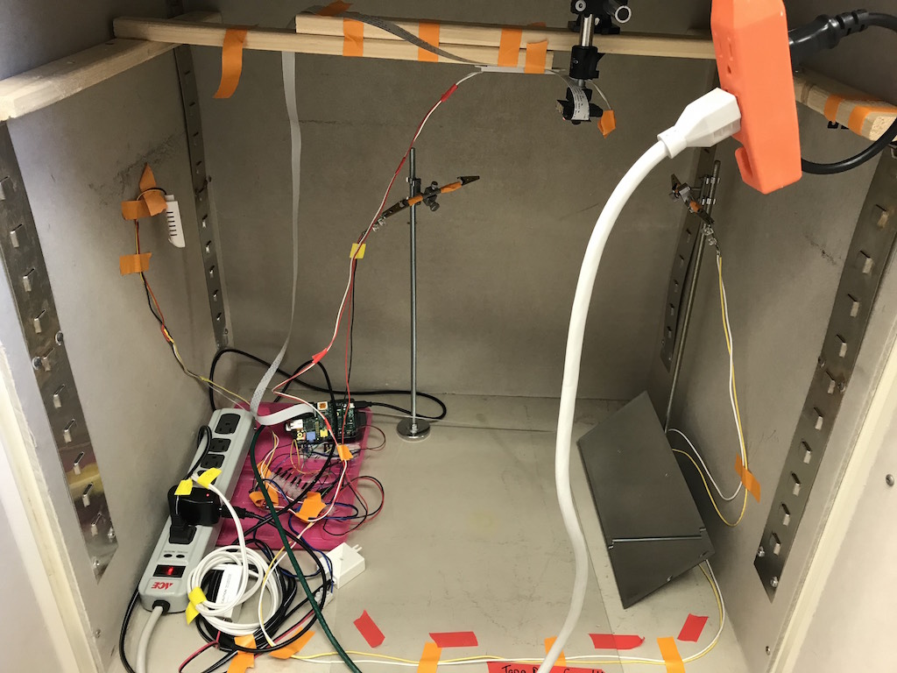
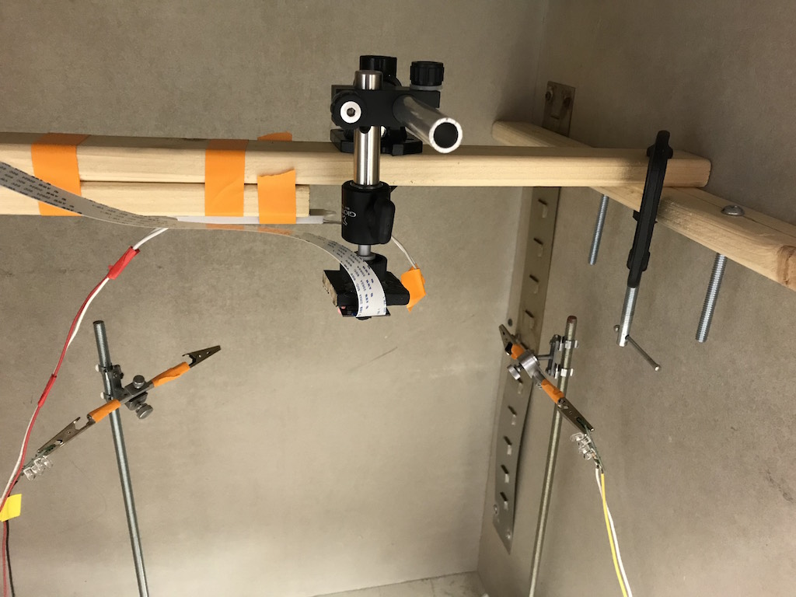
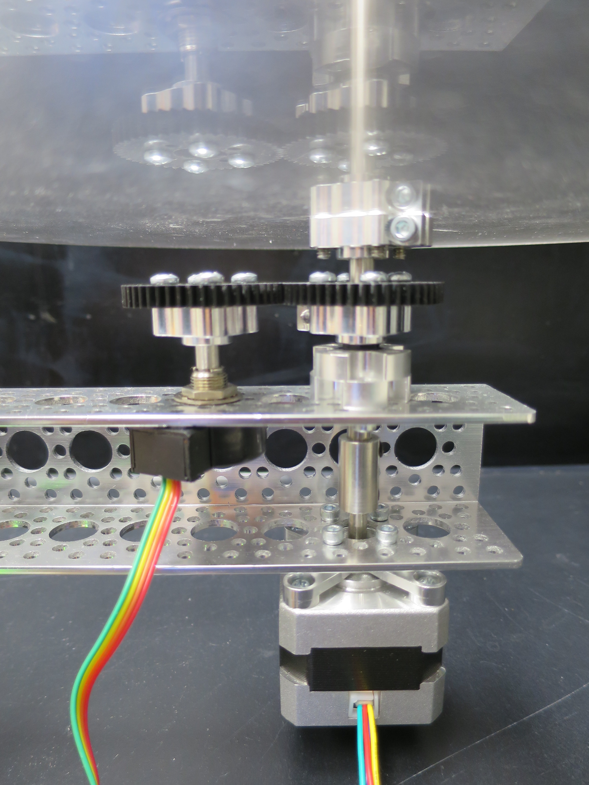
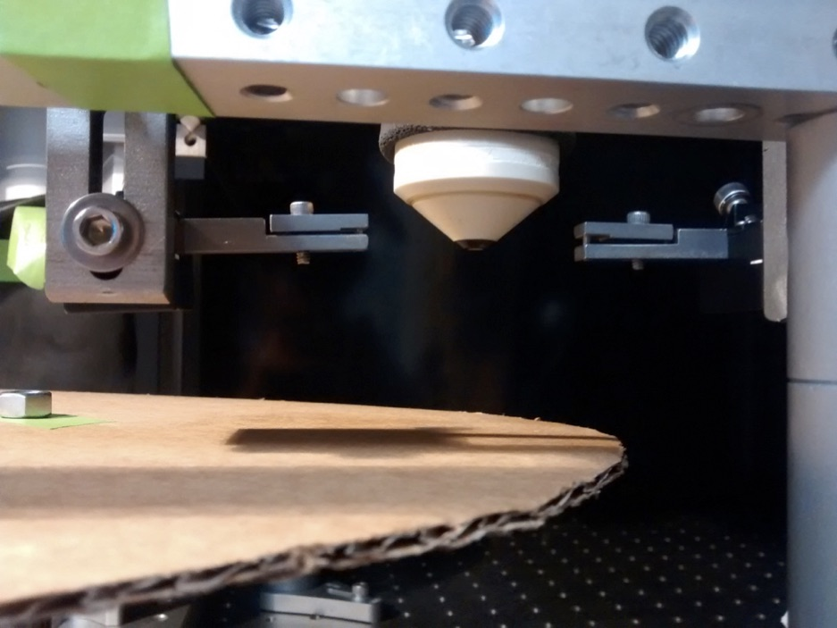

These are images of the behavior box at different development stages.

## Behavior Box

### v0.0

#### Overview

#### Lights and camera

#### Rats nest

### v1.0

Coming soon...

## Treadmill

<TABLE>
<TR>
	<TD>
	
	</TD>
	
	<TD>
Detailed view of circular treadmill including

<UL>
<LI>10" acrylic disk (top)
<LI>Actobotics frame (horizontal aluminum arm)
<LI>Stepper motor (bottom)
<LI>Rotary encoder (left)
<LI>Gears to couple the motor and disk to the rotary encoder
	</TD>
</TR>
</TABLE>

 
 
<TABLE>
<TR>
	<TD>
	
	</TD>

	<TD>
	
	</TD>
</TR>

</TABLE>

### Treadmill on the scope

<TABLE>

<TR>

<TD>

</TD>

<TD>

</TD>

<TR>

<TD>

</TD>

<TD>

</TD>

</TR>

</TABLE>

